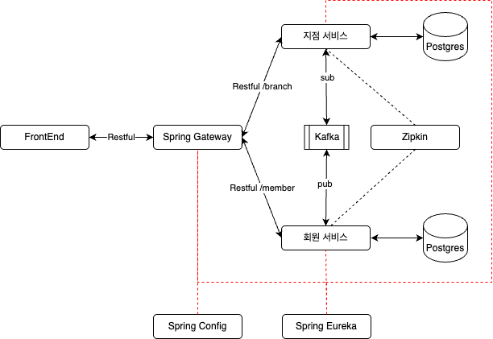

# Crossfit 서비스

### ...
기존 만든 CrossFit 은 monolithic 형태의 서버를 member, branch 로 서버를 분리하고 grpc 로 연결을 시켰다.
FrontEnd 에서 요청이 오면 crossfit-gateway 에서 각 서비스에 grpc 로 연결을 해서 요청 & 수집을 하여 응답을 하는 구조였다.
grpc 를 사용하여 서비스간 요청/응답은 빠르지만, gateway 가 spof 이 될 수 있어서, 
FrontEnd 에서 각 서비스에게 요청을 하고 응답을 받아서 사용자에게 서비스하는 형태로 변경하게 되었다.
작업하다 보니, 이 방식이 일반적인 msa 형태가 아닐까 생각이 ...
프로젝트는 기존에 개별적으로 repository 를 구분했지만, 작업 편의를 위해 submodule 으로 변경하였다.

### 기본
- Java 21
- Spring Boot
- Spring Cloud( Config, Eureka )
- Zipkin
- Kafka
- PostgreSQL

### MSA 형태로 구현
- Config : Spring Config Server
- Eureka : Spring Eureka discovery Server
- Gateway : Spring Gateway
- Member : 회원 가입, 조회 처리, ...
- Branch : 지점 가입, 조회 처리, ...
- Protocol : kafka event 및 grpc 가 필요하면 여기에 존재

### 대략 구성

### 기존 작업 
- Gateway : https://github.com/pranludi/crossfit-gateway
- Member : https://github.com/pranludi/crossfit-member
- Branch : https://github.com/pranludi/crossfit-branch
- Protocol : https://github.com/pranludi/crossfit-protocol
